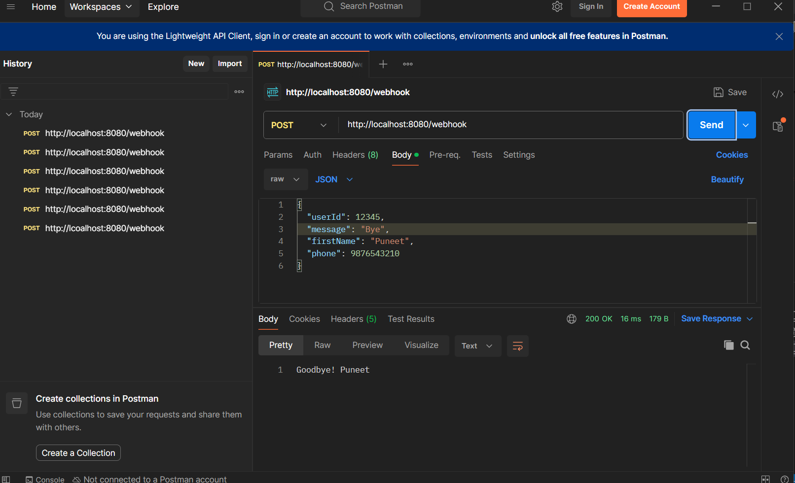
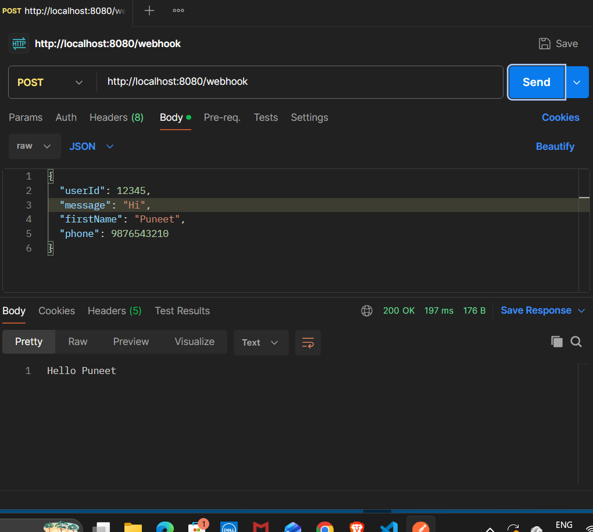
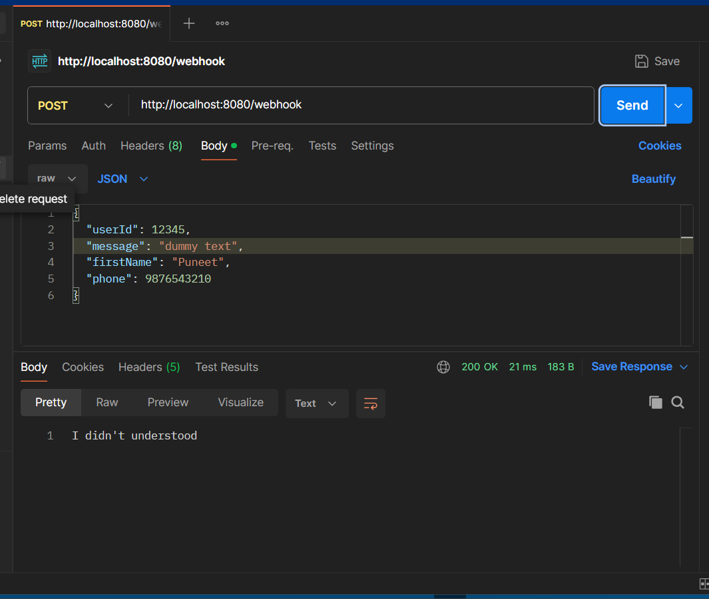

# WhatsApp Chatbot Backend Simulation

This project is a **Spring Boot** based backend simulation for a WhatsApp chatbot. It provides a RESTful API endpoint to receive incoming messages via a webhook and responds with predefined replies based on user input.

## 🚀 Features
- **RESTful Webhook:** Handles POST requests at `/webhook`.
- **Predefined Logic:** - `Hi` -> `Hello [User]`
  - `Bye` -> `Goodbye! [User]`
  - `/start` -> Personalized welcome message.
- **Logging:** Every incoming message is logged with the User ID and message content using SLF4J.
- **Scalable Structure:** Built using a clean DTO and Controller architecture.

## 🛠 Tech Stack
- **Java 17+**
- **Spring Boot 3.5.14**
- **Maven** (Build Tool)
- **Lombok** (For Boilerplate reduction)

---


## 🧪 Testing the API (Simulation)

You can test the webhook using **Postman** or **cURL**.





## 📂 Project Structure
```text
src/main/java/com/bot/mybot/
│
├── controllers/
│   └── WebhookController.java  # Main endpoint for the bot
├── dto/
│   └── Update.java             # Data Transfer Object for incoming JSON
└── MybotApplication.java        # Main Spring Boot Application
```

---


