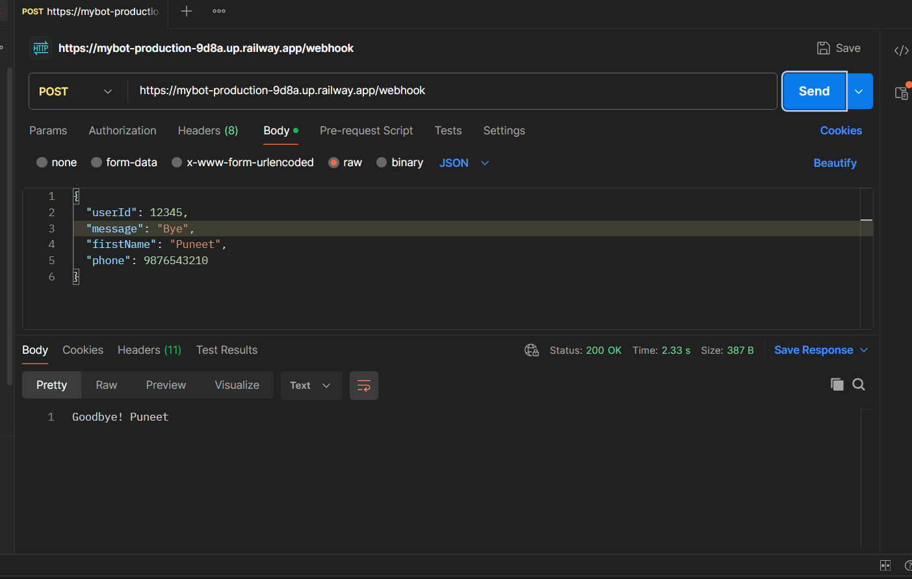
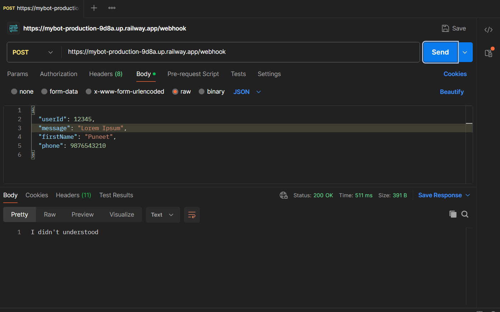
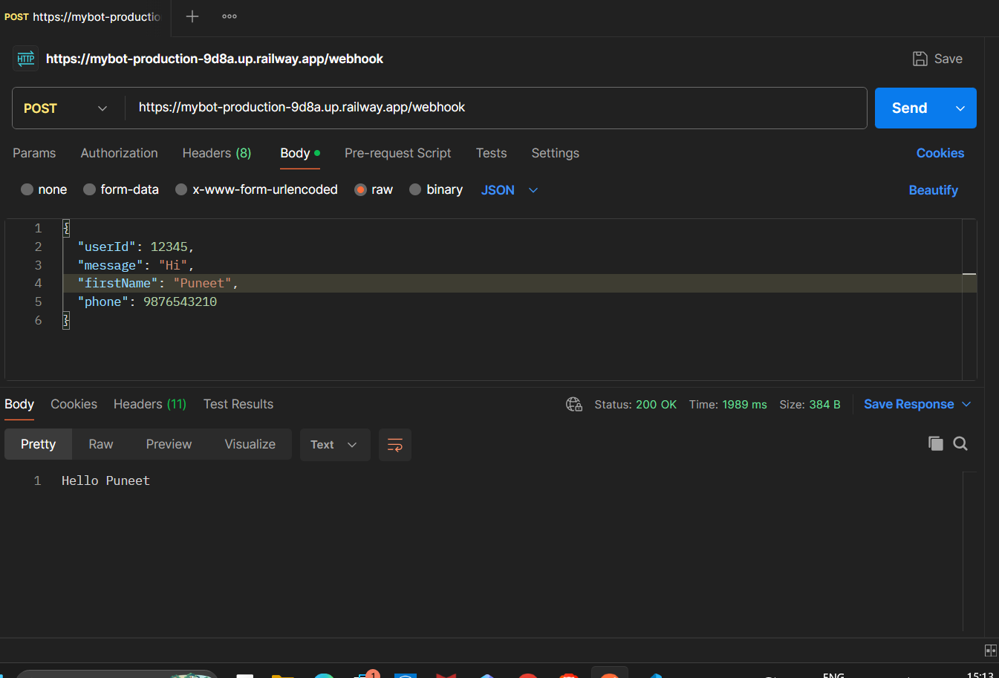

# 🚀 WhatsApp Chatbot  Backend Simulation (Spring Boot)

A production-ready **Spring Boot backend simulation** of a WhatsApp chatbot that processes incoming messages via webhook and responds dynamically.

🔗 **Live API (Deployed on Railway):**
`https://mybot-production-9d8a.up.railway.app/webhook`
---

## 📌 Overview

This project simulates how a WhatsApp chatbot backend works using a webhook-based architecture. It receives user messages as JSON payloads and returns appropriate responses based on predefined logic.

---

## ✨ Features

* ✅ **Webhook API** – Handles incoming messages via `POST /webhook`
* ✅ **Dynamic Responses**

  * `Hi` → `Hello <User>`
  * `Bye` → `Goodbye <User>`
  * `/start` → Personalized welcome message
* ✅ **Logging** – Tracks userId, message, and activity using SLF4J
* ✅ **Clean Architecture** – Controller + DTO based design
* ✅ **Cloud Deployed** – Fully live on Railway

---

## 🛠 Tech Stack

* ☕ **Java 17+**
* 🚀 **Spring Boot**
* 📦 **Maven**
* ⚡ **Lombok**
* ☁️ **Railway (Deployment)**

---

## 🌐 API Endpoint

### `POST /webhook`

**Request Body**

```json
{
  "userId": 12345,
  "message": "/start",
  "firstName": "Puneet",
  "phone": 9876543210
}
```

---

### ✅ Sample Response

```json
{
  "message": "Hello Puneet welcome! How can I assist you"
}
```

---

## 🧪 Testing (Postman / cURL)


### 📸 Screenshots

### Testing locally  ###

1.
<p align="center">
  
</p>

<br/><br/>
2.
<p align="center">
  
</p>
3.
<br/><br/>

<p align="center">
  
</p>
<br/>
---

### Testing After Deployment
1.
<p align="center">
  
</p>
<br/>
<br/>
2.
<p align="center">
  
</p>

<br/>
<br/>
3.
<p align="center">
  
</p>
<br/>
---

## 📂 Project Structure

```text
src/main/java/com/bot/mybot/
│
├── controllers/
│   └── WebhookController.java
├── dto/
│   └── Update.java
└── MybotApplication.java
```

---

## ⚙️ Deployment Details

This application is deployed on **Railway** with:

* Automatic CI/CD via GitHub integration

---

## 🔮 Future Improvements

* 🔹 Integrate real WhatsApp API (Meta / Twilio)
* 🔹 Add database (PostgreSQL / MongoDB)
* 🔹 Implement NLP (Dialogflow / OpenAI)
* 🔹 Authentication & rate limiting
* 🔹 Dockerize for container deployment

---

## 🧠 Learnings

* Webhook-based architecture
* REST API design using Spring Boot
* Cloud deployment on Railway

---

## 👨‍💻 Author

**Puneet Yadav**

---

## ⭐ If you like this project

Give it a ⭐ on GitHub and feel free to contribute!

